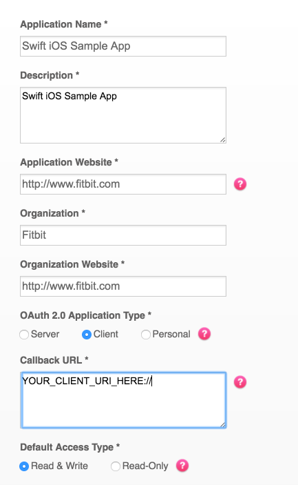
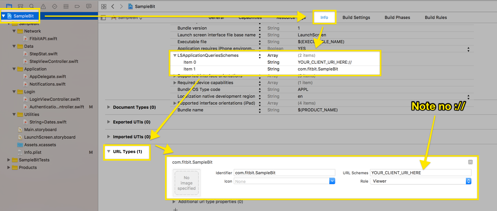

#Fitbit OAuth Swift Boot Demo

This app deals with the boilerplate code of using the Fitbit API with iOS Swift, authenticating via OAuth and making a simple API call. It is meant as a starting point for more robust applications and a demonstration of some of the basic concepts of the API. Swift 3 with Xcode 8 is preferred, though 
 
[Install Xcode 8](http://adcdownload.apple.com/Developer_Tools/Xcode_8/Xcode_8.xip)
[Read More About the Fitbit API](https://dev.fitbit.com/docs/)

##Prerequisites
This document assumes you have Xcode 8 and Swift 3 installed. A tutorial for installing these is out of scope for this project, but there are many resources to instruct you on how to do so.

## Developing Your Own App

First fork this repo

Then create a [Fitbit App Config](https://dev.fitbit.com/apps/new). 

This is the config I used while developing. Your app may not need read/write access.



Once you have setup your app you need to put the client ID and client secret into the application config. You should be able to find both of these on the [manage apps page](https://dev.fitbit.com/apps). These values should be placed in SampleBit/Authentication/AuthenticationController.swift.

```
class AuthenticationController: NSObject, SFSafariViewControllerDelegate {
  let clientID = "YOUR_CLIENT_ID_HERE"
  let clientSecret = "YOUR_CLIENT_SECRET_HERE"
  let redirectURI = "YOUR_CLIENT_URI_HERE://"
  let defaultScope = "YOUR_CLIENT_SCOPE_HERE"
```

Along with the client ID and secret you also need to have a redirect URI that your app responds to. This needs to be setup in your Fitbit App Config, in the AuthenticationController and in the iOS App target's Info: LSApplicationQueriesSchemes, and URL Types. Note that in the URL Types: scheme don't put in the `://` of your redirect uri.

[Read More About iOS URL Schemas](https://developer.apple.com/library/content/documentation/iPhone/Conceptual/iPhoneOSProgrammingGuide/Inter-AppCommunication/Inter-AppCommunication.html#//apple_ref/doc/uid/TP40007072-CH6-SW1)



You should decide on the OAuth scopes for your project. Specifically, define what data your app will
be accessing from people's Fitbit accounts. These are also defined in SampleBit/Authentication/AuthenticationController.swift. By default this file requests every scope, but you should remove those you do not need

[Read more about OAuth Scopes](https://dev.fitbit.com/docs/oauth2/)

Once you have saved you changes starting the app is easy. Simply run the application

After a moment your app should be started and you can follow the login flow.

Once you've logged in you should be able to see your current steps count for today.

The app as written will only access your fitbit profile to demonstrate OAuth working. It only stores tokens in memory and in Safari's cache